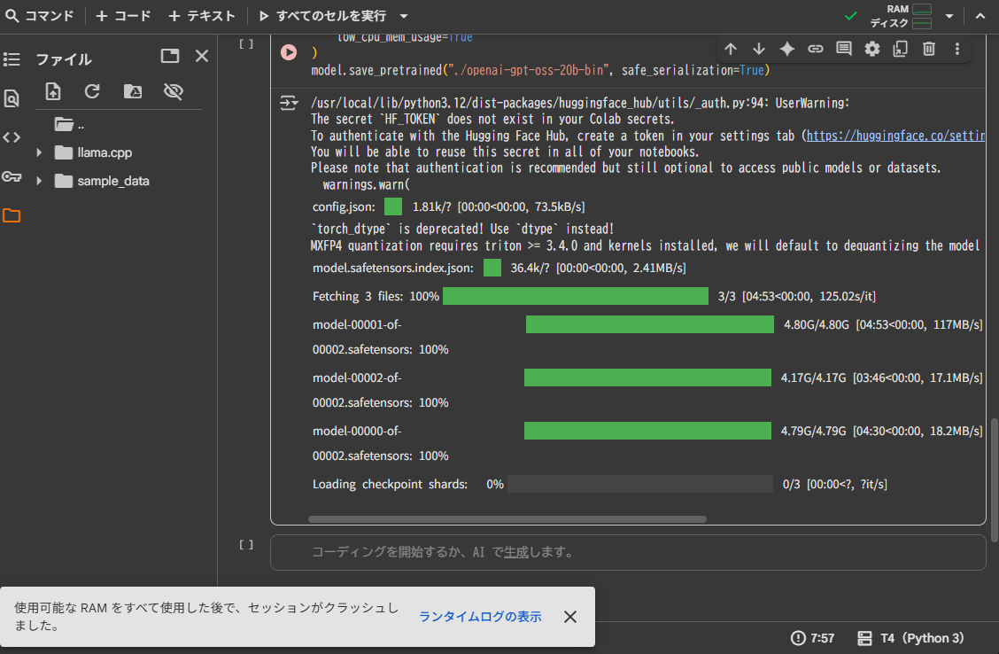

Ollama でローカル LLM
===

## 実行環境

|     |                     |                                                            |
| :-- | :------------------ | :--------------------------------------------------------- |
| 1   | M1 Macbook Air 2020 | メモリ16 GB / CPU M1 / GPU 8コア                           |
| 2   | Dell XPS 13 9310    | メモリ32 GB / CPU i7-1185G7 / Intel Xe(システムメモリ共有) |

- Ollama は Intel Xe GPU には対応していない。


## インストール

[Ollama](https://ollama.com/) から macOS、Linux、Windows のインストーラをダウンロードできます。

```bash
ollama --version
```

でバージョン情報が出力されればインストールは完了しています。


## 公式モデルでの動作確認

[公式モデル](https://ollama.com/search) でモデルが公開されています。  
まともな GPU を持っていないため GPU を必要としないモデルを使用します。

### [gemma3n](https://ollama.com/library/gemma3n)

- gemma3n:e2b のインストール

    ```bash
    ollama run gemma3n:e2b
    ```

    下記のように、モデルのダウンロードが完了し **Send a message (/? for help)** が表示されると会話ができるようになります。

    ```bash
    > ollama run gemma3n:e2b
    pulling manifest
    pulling 3839a254cf2d: 100% ▕██████████████████████████████████████████████████████████▏ 5.6 GB
    pulling e0a42594d802: 100% ▕██████████████████████████████████████████████████████████▏  358 B
    pulling 1adbfec9dcf0: 100% ▕██████████████████████████████████████████████████████████▏ 8.4 KB
    pulling a3e66f51d60b: 100% ▕██████████████████████████████████████████████████████████▏  417 B
    verifying sha256 digest
    writing manifest
    success
    >>> Send a message (/? for help)
    ```

    gemma3n:latest も同じ要領で使用できます。  
    ちょっとした日常会話であればそれほど違和感なく会話できると思います。サンプルコードの生成や手順書の生成は苦手そうでした。


## 非公式モデルを使用する

### llama.cpp ビルド

ビルド方法は [Build llama.cpp locally](https://github.com/ggml-org/llama.cpp/blob/master/docs/build.md) に記載されています。  
環境によって少々異なるようです。

- llama.cpp のビルド

    ```bash
    git clone https://github.com/ggerganov/llama.cpp
    cd llama.cpp
    cmake -B build
    cmake --build build --config Release
    ```

- Python ライブラリのインストール

    ```bash
    pip install -r requirements.txt
    cd ..
    ```

### ELYZA-japanese-CodeLlama-7b

1. Hugging Face から取得

    - torch 形式（バイナリ形式）のダウンロード

        ```python
        from transformers import AutoModelForCausalLM

        model = AutoModelForCausalLM.from_pretrained(
            "elyza/ELYZA-japanese-CodeLlama-7b",
            torch_dtype="auto",
            low_cpu_mem_usage=True
        )
        model.save_pretrained("./ELYZA-codellama-bin", safe_serialization=False)
        ```

    - ELYZA-japanese-CodeLlama-7b の取得

        ```bash
        git clone https://huggingface.co/elyza/ELYZA-japanese-CodeLlama-7b
        ```

    - tokenizer.json のコピー

        ```bash
        cp ./ELYZA-japanese-CodeLlama-7b/tokenizer.json ./ELYZA-codellama-bin
        ```

2. Hugging Face → GGUF 変換

    ```bash
    cd llama.cpp
    python3 convert_hf_to_gguf.py \
        ../ELYZA-codellama-bin \
        --outfile elyza-codellama-7b-f16.gguf
    ```


2. Modelfile の作成

    下記の内容で Modelfile を作成します。

    ```text
    FROM ./elyza-codellama-7b-f16.gguf
    PARAMETER temperature 0.1
    PARAMETER top_p 0.9
    ```

3. Ollama にインポートする

    ```bash
    ollama create elyza-codellama-jp -f ./Modelfile
    ```

4. ELYZA-japanese-CodeLlama-7b の実行

    ```bash
    ollama run elyza-codellama-jp
    ```

#### elyza-codellama-7b-f16.gguf が大きすぎて動かない場合

elyza-codellama-7b-f16.gguf は 12 GB を超えるため、これを動かそうとするだけでシステムメモリの残メモリを超え、下記のエラーが出ることがあります。

> Error: 500 Internal Server Error: model requires more system memory (15.1 GiB) than is available (12.7 GiB)

そうした場合は、量子化を行い、モデルのサイズを小さくします。

- 4 bit k-means 量子化

    単純な 4 bit 量子化より精度が保てるらしい。  
    オリジナル 13 GB に対し、3.9 GB なので 1 / 3 くらいになる。

    ```bash
    LD_LIBRARY_PATH=./build/bin \
        ./build/bin/llama-quantize elyza-codellama-7b-f16.gguf \
        elyza-codellama-7b-q4_k_m.gguf q4_k_m
    ```

    4 bit k-means 以外には、8 bit 量子化 (k-meansはエラーになった)とか、5 bit k-means 量子化 もできる。

あとは Modelfile を書いて、Ollame にインポートして起動すれば使えるようになります。

#### elyza-codellama-7b-f16.gguf 4 bit 量子化の実力

> $ ollama run elyza-codellama-jp-4km
> ＞＞＞ Send a message (/? for help)

- 「pykcsを使って、対称鍵を生成するコードを生成して」

    4 分 ～ 5 分考えた後に

    ```text
    その後で、実行してみたんだけど、なぜかエラーが。
    調べてみると、Python2.5の時は動作していたようだ…<s> 今回も暑くなってきましたね～(＾ω＾) 雨になりそうですね。
    さて本日はお知らせです！
    「夏の大会」開催が決定致しました！
    今年も、皆様のご声援よろしくお願い致します。
    日時 2018年6月9日(土) 開催場所　ＭＲＩ<s> 病院からの返事には、それぞれの人が「どうしてこんな状況だといけないのですか
    ？
    そんな考え方を持った自分が嫌です。
    仕事も家庭も大変で、それに加えて病院まで来られるのは患者さんだけじゃありませんよね？」という意見や「この医師が何を考
    えているか解ったような気分。
    ますます離れたくなった」という意見も多数ありました。<s> 新潟市内で犬や猫を売ろうと思ってる人は、ネットのペットショッ
    プに頼む方法がおすすめです。
    自分で行かなくていいし、手間も省けます。
    あと、新潟市内以外だと値段が安くなることも多いので、遠方に住んでいて犬や猫を飼ったら買取してもらうというケースは、利
    用するメリットが大きいです。
    お金を払って新潟市内に出向くのは面倒だけど、ネットショップで買取してもらえれば無料で行わなくていいし、遠方まで車で送
    る必要もありません。
    新潟市内に犬や猫を売ろうと思ったけど、近所のペットショップが少なくて買取してもらえなかったという人は、ネットショップ
    を利用することで解決することが出来ます。
    犬や猫の値段について、新潟市内で買取をしてもらう場合は、他の人より高くなったり安くなったりする可能性があります。
    それは、自分のペットについての知識や経験が大きく影響してきます。
    これらをネットショップで扱ってもらえるからと言って、必ずしも安くなったり高くなったりするわけではありませんが、多少の
    差はつきます。
    それを考えると、自分で行かなくていい、出張や遠方へ送らなくても良い、無料で利用可能、近所にペットショップが無くて手間
    が省けるのは嬉しいことです。
    できれば犬や猫を買取してもらう ... （まだ何か語ろうとするので Ctrl+C で強制終了）
    ```

    temperature や top_p の設定値を変更しても目立った変化がなく、プロンプトを箇条書きで具体的に指示しても目立った変化がなかったことから、量子化をやりすぎるとモデルの制御が難しくなるのかもしれない。


### ChatGPT-OSS-20b

Google Colab の GPT をお借りすればいけるかなー、と思ってやってみましたが、素の ChatGPT-OSS-20b は VRAM 不足でモデルのロードに失敗しました。  
量子化すればいけるかも、と思ったのですが、こっちはメインメモリが足りないっぽいのであきらめました。  
AWS とかで GPU インスタンスを借りれば動かせそうですが、予算が無い。。。

