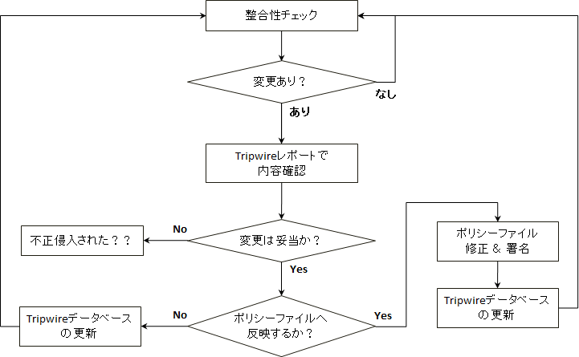

Tripwire
===

## インストール

- Debian / Ubuntu

    ```bash
    sudo apt install -y tripwire
    ```

    インストール中にサイトキーとローカルキーを生成します。  
    Debian Linuxではtwinstall.shやtripwire-setup-keyfileのようなキー生成スクリプトがないようなので、インストール中にキーを生成しなかった場合は、

    ```bash
    sudo dpkg-reconfigure tripwire
    ```

    で生成します。サイトキーとローカルキーは異なるPass Phraseを設定することが推奨されています。サイトキーは設定ファイルの署名に、ローカルキーはTripwireデータベースの署名に使用します。  
    異なる鍵で署名することで、どちらかの鍵が漏えいしても即座にセキュリティの脅威にならないようにするためらしいのです。


## 設定

設定ファイルは tripwire 自身の設定ファイルを記述する `twcfg.txt` と、どのようなルールで Tripwire データベースを作成するかを記述する `twpol.txt` の2つから構成されます。

### twcfg.txt

- EDITOR

    editor コマンドの使い方がわからないので vi に変更。

    ```text
    /usr/bin/editor
    ↓
    /usr/bin/vi
    ```

- SMTPHOST

    完全性チェックの結果を管理者にメール送信する際使用するSMTPサーバを指定します。

- twcfg へ署名

    ```bash
    sudo twadmin -m F -S /etc/tripwire/site.key /etc/tripwire/twcfg.txt
    # または、
    sudo twadmin --create-cfgfile -S /etc/tripwire/site.key /etc/tripwire/twcfg.txt
    ```

    署名後、twcfg.txt は不要になるため削除しても大丈夫です。

- twcfg.txt の復元

    twcfg.txt は下記のコマンドで復元できます。

    ```bash
    sudo twadmin -m f > /etc/tripwire/twcfg.txt
    または、
    sudo twadmin --print-cfgfile > /etc/tripwire/twcfg.txt
    ```

- メール送信テスト

    ```bash
    tripwire --test --email root@localhost
    または、
    tripwire -m t --email root@localhost
    ```

    localhost でメールサーバが動いていれば、root 宛にテストメールが送信されると思います。


## twpol.txt

twpol.txtの設定はいろいろ個別対応が必要なのでとりあえず詳細は省略。デフォルト設定では、いくつか存在しないパスが記述されているため、親切な方が作成・公開されていた perl スクリプト (下記) を拝借させて頂いて、

- twpolmake.pl

    ```perl
    #!/usr/bin/perl
    # Tripwire Policy File customize tool
    # ----------------------------------------------------------------
    # Copyright (C) 2003 Hiroaki Izumi
    # This program is free software; you can redistribute it and/or
    # modify it under the terms of the GNU General Public License
    # as published by the Free Software Foundation; either version 2
    # of the License, or (at your option) any later version.
    # This program is distributed in the hope that it will be useful,
    # but WITHOUT ANY WARRANTY; without even the implied warranty of
    # MERCHANTABILITY or FITNESS FOR A PARTICULAR PURPOSE.  See the
    # GNU General Public License for more details.
    # You should have received a copy of the GNU General Public License
    # along with this program; if not, write to the Free Software
    # Foundation, Inc., 59 Temple Place - Suite 330, Boston, MA  02111-1307, USA.
    # ----------------------------------------------------------------
    # Usage:
    #    perl twpolmake.pl {Pol file}
    # ----------------------------------------------------------------
    #
    $POLFILE=$ARGV[0];

    open(POL,"$POLFILE") or die "open error: $POLFILE" ;
    my($myhost,$thost) ;
    my($sharp,$tpath,$cond) ;
    my($INRULE) = 0 ;

    while (<POL>) {
        chomp;
        if (($thost) = /^HOSTNAME\s*=\s*(.*)\s*;/) {
            $myhost = `hostname` ; chomp($myhost) ;
            if ($thost ne $myhost) {
                $_="HOSTNAME=\"$myhost\";" ;
            }
        }
        elsif ( /^{/ ) {
            $INRULE=1 ;
        }
        elsif ( /^}/ ) {
            $INRULE=0 ;
        }
        elsif ($INRULE == 1 and ($sharp,$tpath,$cond) = /^(\s*\#?\s*)(\/\S+)\b(\s+->\s+.+)$/) {
            $ret = ($sharp =~ s/\#//g) ;
            if ($tpath eq '/sbin/e2fsadm' ) {
                $cond =~ s/;\s+(tune2fs.*)$/; \#$1/ ;
            }
            if (! -s $tpath) {
                $_ = "$sharp#$tpath$cond" if ($ret == 0) ;
            }
            else {
                $_ = "$sharp$tpath$cond" ;
            }
        }
        print "$_\n" ;
    }
    close(POL) ;
    ```

```bash
sudo perl /etc/tripwire/twpolmake.pl /etc/tripwire/twpol.txt > /etc/tripwire/twpol.txt.new
```

のように実行して、存在しないファイルパスをコメント化します。

- twpol へ署名

    ```bash
    sudo twadmin -m P -S /etc/tripwire/site.key /etc/tripwire/twpol.txt.new
    # または、
    sudo twadmin --create-polfile -S /etc/tripwire/site.key /etc/tripwire/twpol.txt.new
    ```

    署名後、twpol.txt.new は不要になるため削除しても大丈夫です。

- twpol.txt の復元

    twcfg.txt は下記のコマンドで復元できます。

    ```bash
    sudo twadmin -m p > /etc/tripwire/twpol.txt
    # または、
    sudo twadmin --print-polfile > /etc/tripwire/twpol.txt
    ```


## Tripwireデータベースの作成・更新

- データベース作成／再作成

    以下のコマンドでtripwireが完全性チェックに使用するデータベースを作成します。

    ```bash
    LANG=C
    sudo tripwire --init

    Please enter your local passphrase: <ローカルキーのPass Phrase>
    ```

    または、

    ```bash
    LANG=C
    sudo tripwire -m i

    Please enter your local passphrase: <ローカルキーのPass Phrase>
    ```

    - データベース作成時にエラーが発生（ファイル・ディレクトリがないとか）するとlocaleに従ってエラーメッセージを日本語で出力しようとしてくれるみたいなのですが、文字コードせいか文字化けしてしまうので1行目でLANG=Cを実行しています。エラーを気にしない、あるいは、日本語メッセージが文字化けないのであれば実行不要です。
    - このコマンドは、主にtwpolを作成／更新したときに実行します。

- データベースの更新

    以下のコマンドでtripwireが完全性チェックに使用するデータベースを更新します。

    ```bash
    sudo tripwire --update --twrfile /var/lib/tripwire/report/$(HOSTNAME)-$(DATE).twr
    # または、
    sudo tripwire -m u --twrfile /var/lib/tripwire/report/$(HOSTNAME)-$(DATE).twr
    ```

    完全性チェックの実行結果を参照し、更新されたファイルがあり、その更新が妥当なものであった場合、データベースを再作成してはいけない、というルールはありませんが、通常はデータベースを更新します。「--twrfile」オプションでは完全性チェック結果ファイルを指定し、指定されたファイルの内容をデータベースに反映します。


## 完全性チェックの実行

```bash
sudo tripwire --check
# または、
sudo tripwire -m c
```

を実行すると完全性チェックを実行します。オプションに-Mまたは--email-reportを指定するとチェック結果をメールで送信してくれます。  
完全性チェックを実行すると/var/lib/tripwire/report/$(HOSTNAME)-$(DATE).twrというファイルにチェック結果が出力されます。

### report の参照方法

```bash
sudo tripwire --update -r /var/lib/tripwire/report/$(HOSTNAME)-$(DATE).twr
# または、
sudo tripwire -m u -r /var/lib/tripwire/report/$(HOSTNAME)-$(DATE).twr
```


## Tripwire 運用の流れ

Tripwire の運用は、だいたい下記のような流れになるらしい。


