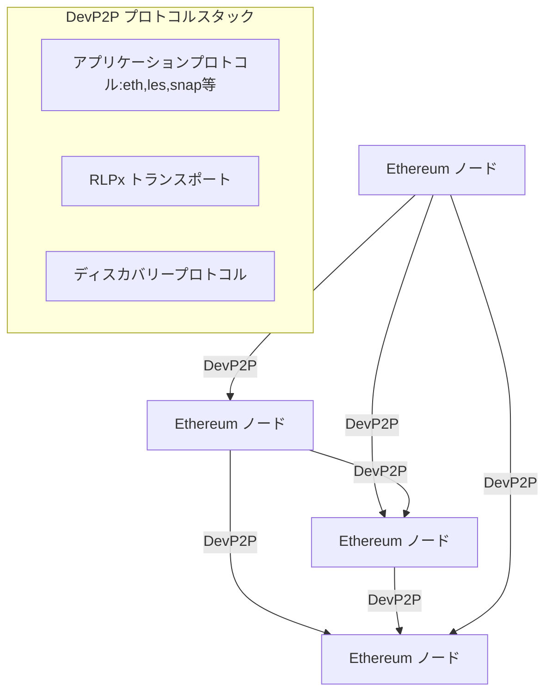
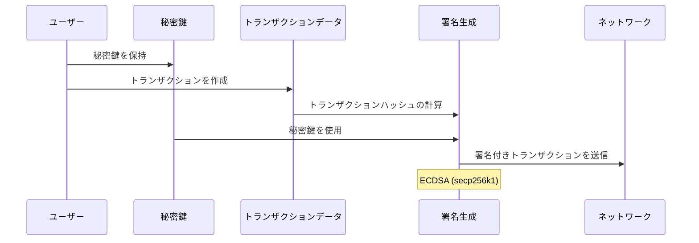
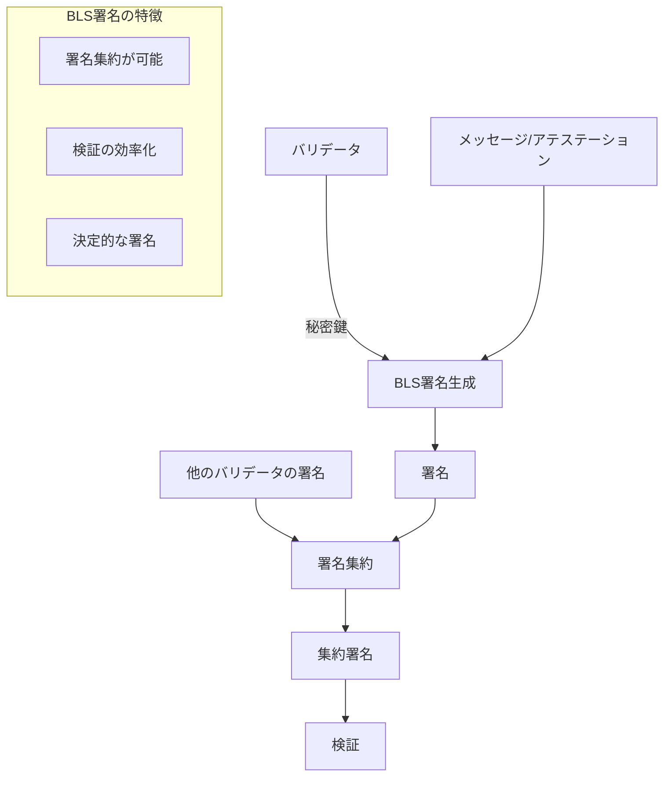
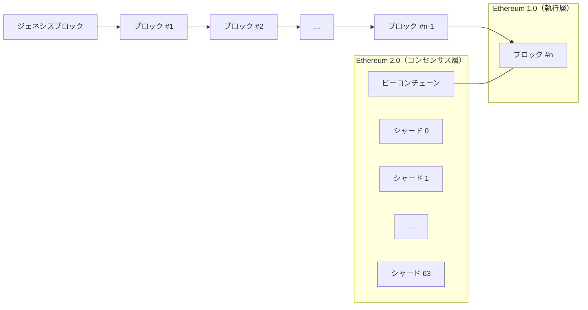
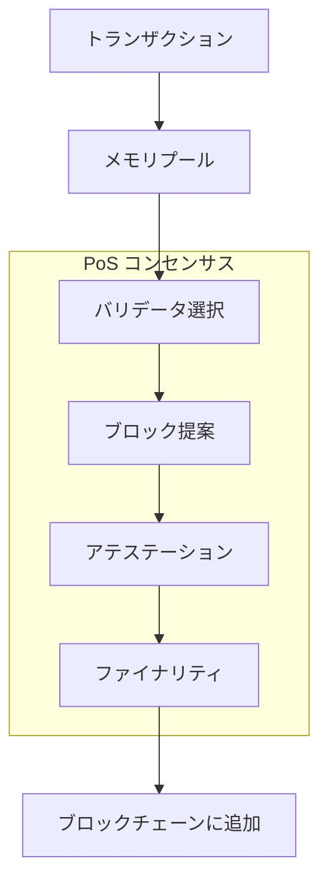

# Ethereum

---

# Ethereumの仕組み

## ① P2Pネットワークプロトコル

Ethereumは分散型のP2P（Peer-to-Peer）ネットワークを基盤としています。このネットワークはDevP2Pと呼ばれるプロトコルスタックを使用しています。

### DevP2Pの主要コンポーネント

- **ノードディスカバリー：**Kademlia DHT（分散ハッシュテーブル）ベースのプロトコルを使用して新しいピアを発見します。UDPを使用します。
- **RLPx：**暗号化されたトランスポートプロトコルで、ノード間の安全な通信を可能にします。TCPを使用します。
- **サブプロトコル：**eth（メインのEthereumプロトコル）、les（Light Ethereum Subprotocol）、snap（スナップショットシンク）などがあります。

各ノードは、ブロックとトランザクションの伝播を通じてネットワークの状態を同期します。

## ② ETH1署名の仕様

Ethereum 1.0（執行層）では、楕円曲線デジタル署名アルゴリズム（ECDSA）を使用してトランザクションに署名します。具体的にはsecp256k1曲線が使用されています。

### 署名プロセス

- **メッセージハッシュ：**トランザクションデータをKeccak-256（Ethereumの変形SHA-3）でハッシュ化
- **署名生成：**秘密鍵を使用してハッシュに署名（r, s, v の3つの値で構成）
- **v値：**リカバリーID（鍵の復元に使用）、チェーンIDを含む場合があります
- **アドレス検証：**署名から公開鍵を復元し、それをハッシュ化してアドレスと比較

## ③ ETH2署名の仕様

Ethereum 2.0（コンセンサス層）では、BLS（Boneh-Lynn-Shacham）署名が使用されています。これはより効率的な集約署名を可能にします。

### BLS署名の主要特性

- **署名の集約：**複数の署名を単一の署名に集約でき、検証が効率的になります
- **決定的：**同じメッセージと秘密鍵から常に同じ署名が生成されます
- **使用曲線：**BLS12-381楕円曲線を使用しています
- **適用場所：**主にステーキング、アテステーション、ブロック提案に使用されます

## ④ ブロックチェーンの仕様

Ethereumのブロックチェーンは、トランザクションを含むブロックがリンクされた構造を持ちます。現在はEthereum 1.0（執行層）とEthereum 2.0（コンセンサス層）が共存しています。

### Ethereum 1.0（執行層）のブロック構造

- **ヘッダー：**前のブロックハッシュ、タイムスタンプ、難易度、ノンス等のメタデータ
- **トランザクションリスト：**ブロックに含まれる全てのトランザクション
- **アンクルブロックヘッダー：**（あれば）有効だが、メインチェーンに含まれなかったブロック
- **ステート：**全アカウントの最新状態（直接ブロックには保存されず、マークルパトリシアツリーで参照）

### Ethereum 2.0（コンセンサス層）の構造

- **ビーコンチェーン：**システム全体を調整するメインチェーン
- **エポック：**32スロット（約6.4分）で構成される時間単位
- **スロット：**12秒ごとのブロック生成機会
- **バリデータ：**32 ETHをステーキングして、ブロック生成と検証に参加するノード
- **シャード：**並列処理を可能にする64のチェーン（将来的に実装予定）

Ethereumは2022年9月のマージ以降、コンセンサスメカニズムとしてPoW（Proof of Work）からPoS（Proof of Stake）に移行しました。これにより、エネルギー消費を大幅に削減し、スケーラビリティを向上させています。

PoSシステムでは、バリデータはランダムに選択され、彼らの持つステーク（預けたETH）に比例して選ばれる確率が高くなります。不正行為をすると、ステークの一部または全部が没収される仕組み（スラッシング）があり、セキュリティを確保しています。