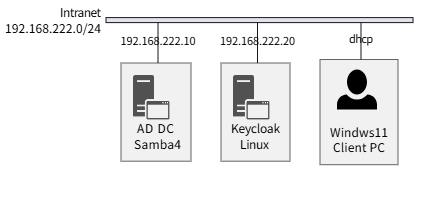
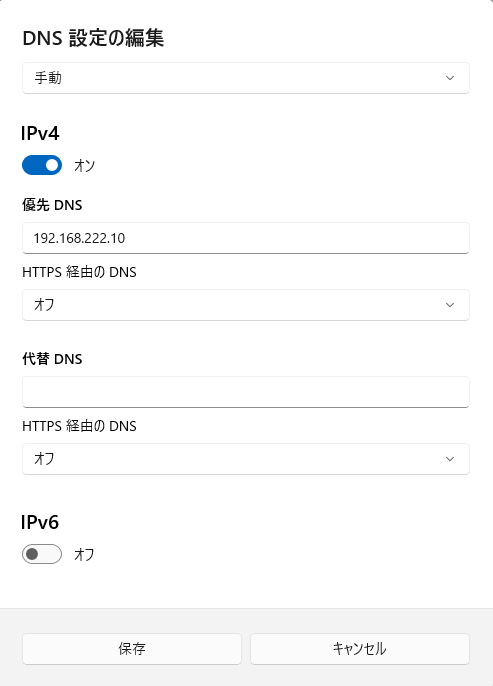

Keycloak と Samaba AD で Windows SSO
===

## ネットワーク構成



- Samba4 サーバ

    | 項目      | 内容                |
    | :-------- | :------------------ |
    | OS        | Ubuntu Server 24.04 |
    | ホスト名  | dc1                 |
    | ドメイン  | EXAMPLE.LOCAL       |
    | NetBIOS名 | EXAMPLE             |
    | IPv4      | 192.168.222.10      |

- Keycloak

    | 項目     | 内容                |
    | :------- | :------------------ |
    | OS       | Ubuntu Server 24.04 |
    | ホスト名 | keycloak            |
    | IPv4     | 192.168.222.20      |
    ❘ Keycloak | 26.4.4               |

- Windows Client

    | 項目 | 内容                |
    | :--- | :------------------ |
    | OS   | Windows 11 Pro 25H2 |


---

## Samba4 サーバ

### Samba のインストール

```bash
sudo apt update && sudo apt upgrade -y
sudo apt install -y \
    samba \
    smbclient \
    winbind \
    krb5-user \
    dnsutils
```

krb5-user インストール途中で KERBEROS 関連の REALM として EXAMPLE.LOCAL を入力する。3 回くらい聞かれます。

### IP アドレスの固定

- /etc/netplan/50-cloud-init.yaml

    ```yaml
    network:
    version: 2
    ethernets:
      eth0:
      dhcp4: no
      addresses:
        - 192.168.222.10/24
      gateway4: 192.168.222.2
      nameservers:
        addresses:
          - 127.0.0.1
    ```

    ```bash
    sudo netplan apply
    ```

### Samba AD ドメインプロビジョニング

- 設定ファイルのバックアップ

    ```bash
    sudo mv /etc/samba/smb.conf /etc/samba/smb.conf.origin
    ```

- 既存の AD 関連ファイル削除 (最初からやり直す場合)

    ```bash
    # Samba 関連プロセスの停止
    sudo systemctl stop samba-ad-dc
    sudo systemctl stop smbd nmbd winbind
    # AD 関連ファイル削除
    sudo rm -rf /var/lib/samba/private/*
    ```

- AD ドメインプロビジョニング

    ```bash
    sudo samba-tool domain provision \
        --use-rfc2307 \
        --realm=EXAMPLE.LOCAL \
        --domain=EXAMPLE \
        --server-role=dc \
        --dns-backend=SAMBA_INTERNAL \
        --adminpass='P@ssw0rD'
    ```

    - AD プロビジョニング後の Administrator パスワードを変更する場合

        ```bash
        sudo samba-tool user \
            setpassword Administrator \
            --newpassword='P@ssw0rd'
        ```

- TCP/UDP 53 番ポートをバインドしているプロセスの停止

    ```bash
    sudo systemctl stop systemd-resolved
    sudo systemctl disable systemd-resolved
    sudo rm /etc/resolve.conf    # 一度消した方がよいかもしれない
    ```

- AD 関連プロセスの起動

    ```bash
    sudo systemctl enable samba-ad-dc
    sudo systemctl start samba-ad-dc
    sudo systemctl status samba-ad-dc
    ```

### DNS の参照を自分自身へ向ける

- /etc/resolv.conf

    ```text
    nameserver 127.0.0.1
    search example.local
    ```

- /etc/samba/smb.conf

    DNS Fowarder を Google 等の DNS サーバを設定しておくと、Samba の DNS で解決できなかった名前は Fowarder に問い合わせるようになります。

    ```bash
    # Global parameters
    [global]
            #dns forwarder = 127.0.0.53
            dns forwarder = 8.8.8.8

    ・・・以下省略・・・
    ```

- AD 関連プロセスの再起動

    ```bash
    sudo systemctl restart samba-ad-dc
    ```

### Kerberos の設定

- /etc/krb5.conf

```ini
[libdefaults]
        default_realm = EXAMPLE.LOCAL
        dns_lookup_realm = true         # この行追加
        dns_lookup_kdc = true           # この行追加

        ・・・中略・・・
[realms]
        EXAMPLE.LOCAL = {
                #kdc = EXAMPLE.LOCAL
                #admin_server = EXAMPLE.LOCAL
                kdc = dc1.example.local    
                admin_server = dc1.example.local
        }

        ・・・後略・・・
```

### 動作確認

- Samba の DNS 関連の確認

    ```bash
    samba-tool domain level show
    samba-tool user list
    host -t SRV _ldap._tcp.example.local
    host -t SRV _kerberos._tcp.example.local
    ```
    
    ```bash
    samba-tool dns query localhost \
        example.local _ldap._tcp SRV \
        -U Administrator@EXAMPLE.LOCAL
    ```
    adminpass に設定したパスワードを入力する。

- Kerberos 認証の確認

    ```bash
    kinit Administrator
    # または
    kinit Administrator@EXAMPLE.LOCAL
    ```
    adminpass に設定したパスワードを入力する。

---

## Keycloak

### IP アドレスの固定

- /etc/netplan/50-cloud-init.yaml

    ```yaml
    network:
    version: 2
    ethernets:
      eth0:
      dhcp4: no
      addresses:
        - 192.168.222.20/24
      gateway4: 192.168.222.2
      nameservers:
        addresses:
          - 192.168.222.10
    ```

    ```bash
    sudo netplan apply
    ```

### /etc/resolve.conf

- systemd-resolved を止める

    ```bash
    sudo systemctl stop systemd-resolved
    sudo systemctl disable systemd-resolved
    sudo rm /etc/resolve.conf    # 一度消した方がよいかもしれない
    ```

- /etc/resolve.conf

    ```text
    nameserver 192.168.222.10
    search example.local
    ```

### Keycloak のインストール

- JDK 等のインストール

    ```bash
    sudo apt install -y openjdk-21-jdk unzip
    ```

- Kyecloack のインストール

    ```bash
    cd /opt
    wget https://github.com/keycloak/keycloak/releases/download/26.4.4/keycloak-26.4.4.zip
    unzip keycloak-26.4.4.zip
    mv keycloak-26.4.4 keycloak
    ```

### Samba AD サーバの自己証明書を信頼させる

- Samba サーバ

    ```bash
    sudo cp /var/lib/samba/private/tls/cert.pem /usr/local/share/ca-certificates/samba4.crt
    sudo update-ca-certificates
    ```

- Keycloak サーバ

    Samba サーバの /var/lib/samba/private/tls/cert.pem は scp 等を利用してコピーするものとします。

    ```bash
    sudo cp /tmp/cert.pem /usr/local/share/ca-certificates/samba4.crt
    sudo update-ca-certificates
    ```

- Java の信頼する証明書

    ```bash
    sudo keytool -import -trustcacerts -alias samba4 \
        -file /usr/local/share/ca-certificates/samba4.crt \
        -keystore /usr/lib/jvm/java-1.21.0-openjdk-amd64/lib/security/cacerts \
        -storepass changeit -noprompt
    ```

    - 追加できたことの確認

        ```bash
        sudo keytool -list \
            -keystore /usr/lib/jvm/java-1.21.0-openjdk-amd64/lib/security/cacerts \
            -storepass changeit | grep samba4
        ```

### Samba AD の Keycloak 用サービスアカウント作成

- サービスアカウント作製

    ```bash
    # サービスアカウント登録
    sudo samba-tool user create keycloak_svc "P@ssw0rD" --given-name=Keycloak --surname=Service
    # 確認
    samba-tool user show keycloak_svc
    ```

- Keycloak 用 Service Principal Name(SPN) の登録

    ```bash
    # SPN 作成
    sudo samba-tool spn add HTTP/keycloak.example.local keycloak_svc
    # 確認
    sudo samba-tool spn list keycloak_svc
    ```

- Keycloak 用サービスアカウントが Kerberos で利用する暗号アルゴリズムの指定

    ```bash
    sudo apt-get install -y ldb-tools
    ```

    ```bash
    sudo ldbmodify -H /var/lib/samba/private/sam.ldb <<EOF
    dn: CN=Keycloak Service,CN=Users,DC=example,DC=local
    changetype: modify
    replace: msDS-SupportedEncryptionTypes
    msDS-SupportedEncryptionTypes: 24
    EOF
    ```

    - `24` の意味

        | 10進数 | 2進数             | アルゴリズム            |
        | :----- | :---------------- | :---------------------- |
        | 8      | 0x08 (0b00001000) | AES128-CTS-HMAC-SHA1-96 |
        | 16     | 0x10 (0b00010000) | AES256-CTS-HMAC-SHA1-96 |                         

        二つのアルゴリズムの2進数値を OR すると 0b00011000 になり、10進数に変換すると24になるので「暗号アルゴリズムはAES128とAES256を使用する」という意味になります。

### Keytab ファイルの生成

- Samba サーバでの操作

    ```bash
    sudo samba-tool domain exportkeytab \
        --principal=HTTP/keycloak.example.local@EXAMPLE.LOCAL \
        /tmp/keycloak.keytab
    ```

    ここで作成した keycloak.keytab ファイルを Keycloak サーバにコピーします。

    ```bash
    scp /tmp/keycloak.keytab Keycloakサーバ:/tmp
    ```

    - keycloak.keytab の内容確認

        ```bash
        klist -k -t -K -e /tmp/keycloak.keytab
        ```

- Keycloak サーバでの操作

    ```bash
    # 権限設定
    sudo chmod 600 /opt/keycloak/keycloak.keytab
    ```

### Keycloak の起動

- 初期設定（standaloneモード）

    ```bash
    cd /opt/keycloak/bin
    sudo ./kc.sh build
    ```

本番稼働は考えていないので、開発用で起動します。

- Keycloak の起動 (開発用)

    ```bash
    KC_BOOTSTRAP_ADMIN_USERNAME=admin \
        KC_BOOTSTRAP_ADMIN_PASSWORD=admin \
        ./kc.sh start-dev
    ```

### AD 連携

1. 左側メニューの一番下の **User federation** を選択
2. User federation メニューから **Add LDAP provider**

3. 設定

    デフォルト値を変更した項目だけ記載する。

    - Connection and authentication settings
        - Connection URL:
            - ldaps://dc1.example.local:636

                ldap://dc1.example.local:389 を設定して **Enable StartTLS** を **On** でもよい気がしますが、**Save** ボタン押下時にエラーが出たので、StartTLS は諦めました。

        - Bind DN: Administrator@EXAMPLE.LOCAL
        - Bind credentials: Administrator パスワード

    - LDAP searching and updating
        - Edit mode: READ_ONLY
        - Users DN: CN=Users,DC=example,DC=local
        - Username LDAP attribute: sAMAccountName
        - Search scope: Subtree

    - Kerberos integration
        - Kerberos realm: EXAMPLE.LOCAL
        - Server principal: HTTP/keycloak.example.local@EXAMPLE.LOCAL
        - Key tab: /opt/keycloak/keycloak.keytab
        - Kerberos principal attribute: userPrincipalName
        - Debug: On
        - Use Kerberos for password authentication: On

4. 動作確認

    設定画面の各所で接続確認は実施できましたが、下記

    User federation -> LDAP 画面の右上の **Action** から、**Sync all users** を選択すると、AD サーバに登録されているユーザを Keycloak に取り込むことができます。  
    これに失敗する場合は、LDAP の設定がどこか間違っています。


## Windows クライアントのドメイン参加準備

### Samba サーバ

- Samba AD の DNS に Keycloak サーバの A レコードを追加

    ```bash
    sudo samba-tool dns add \
        dc1.example.local example.local \
        keycloak A 192.168.222.20 -U Administrator
    ```

- SSO 動作確認用ユーザアカウント登録

    ```bash
    sudo samba-tool user create ynaka P@ssw0rD
    ```

### Keycloak サーバ

User federation -> LDAP 画面の右上の **Action** から、**Sync changed users** を選択すると、ユーザが 1 アカウント追加された旨のメッセージが表示されると思います。


## Windows クライアントの設定

- 設定 -> ネットワークとインターネット -> イーサネット -> DNS サーバの割り当て -> 編集 ボタン押下

    

    下記の ping コマンドで応答があれば OK。

    ```powershell
    ping dc1.example.local
    ping keycloak.example.local
    ```

- 設定 -> システム -> バージョン情報 -> ドメインまたはワークグループ -> **変更(C)...** ボタンを押下

    **所属するグループ** で **ドメイン** を選択し、テキストボックスに **example.local** を入力する。

    ドメインに参加するためのアクセス許可のあるアカウントには Administrator を入力し、Administrator のパスワードを入力する。

    

    が表示されればドメインに参加できてます。  
    再起動すると example.local ドメインのユーザで Windows にログインできるようになっていると思います。


apt install ldb-tools ldap-utils

ldapsearch -x -H ldaps://dc1.example.local:636 \
    -D "CN=Administrator,CN=Users,DC=example,DC=local" \
    -W -b "DC=example,DC=local"

ldapsearch -x -H ldaps://dc1.example.local:636 \
    -D "Administrator@EXAMPLE.LOCAL" \
    -W -b "DC=example,DC=local"


Edge の設定
- profile を
- コントロールパネルのイントラネットのサイトで「*.example.local」をイントラネット登録する


## 参考サイト

- [とほほのKeycloak入門](https://www.tohoho-web.com/ex/keycloak.html)

