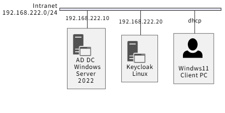
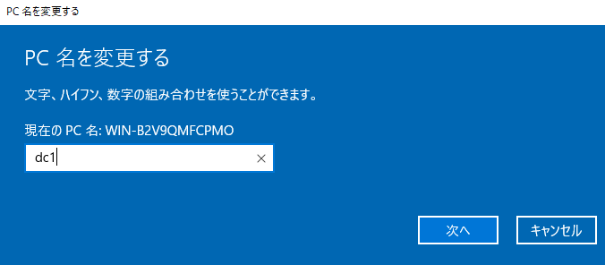
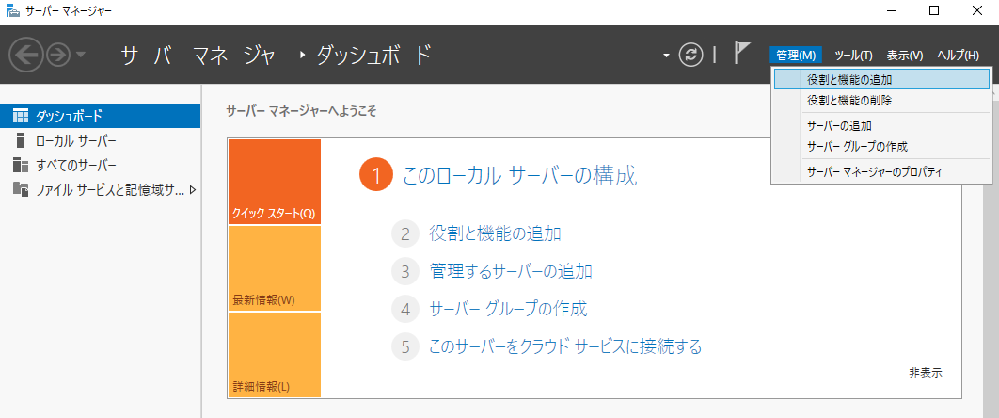
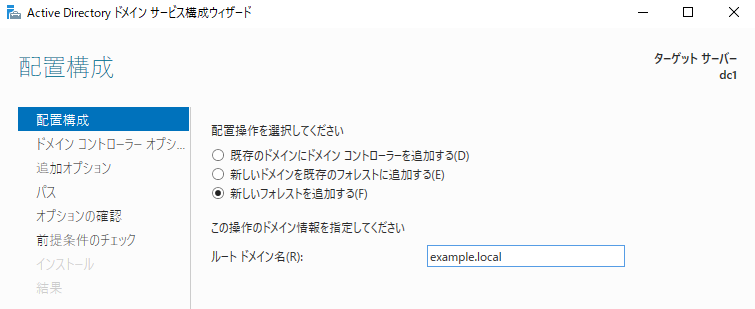

Keycloak と Samaba AD で Windows SSO
===

## ネットワーク構成



- Samba4 サーバ

    | 項目      | 内容                |
    | :-------- | :------------------ |
    | OS        | Windows Server 2022 |
    | ホスト名  | dc1                 |
    | ドメイン  | EXAMPLE.LOCAL       |
    | NetBIOS名 | EXAMPLE             |
    | IPv4      | 192.168.222.10      |

- Keycloak

    | 項目     | 内容                |
    | :------- | :------------------ |
    | OS       | Ubuntu Server 24.04 |
    | ホスト名 | keycloak            |
    | IPv4     | 192.168.222.20      |
    ❘ Keycloak | 26.4.4               |

- Windows Client

    | 項目 | 内容                |
    | :--- | :------------------ |
    | OS   | Windows 11 Pro 25H2 |


---

## Windows Server 2022

### IP アドレスとコンピュータ名の設定

1. 静的IPアドレスの設定: ADサーバに静的IPアドレスを設定します。

    設定 ⇒ ネットワークとインターネット ⇒ イーサネット ⇒ ネットワーク ⇒ IP 設定の編集ボタンを押下

    

2. コンピューター名の変更: サーバーマネージャーから適切なコンピューター名に変更し、再起動します。

    設定 ⇒ システム ⇒ 詳細情報 ⇒ この PC の名前を変更

    

一旦、OS を再起動する。


### AD DS のインストール

1. サーバーマネージャ ⇒ 管理 ⇒ 役割と機能の追加

    

2. **インストールの種類の選択** 画面で **役割ベースまたは機能ベースのインストール** を選択。
3. **対象サーバーの選択** 画面でローカルサーバー (dc1) を選択。
4. **サーバーの役割の選択** 画面で **Active Directory ドメイン サービス** にチェックを入れる。
5. **次へ** ボタンでページを送り、**インストール** ボタンを押下する。

必要かどうかはわからないけど、一応再起動する。

### ドメインコントローラーへの昇格（AD DS の構成）

1. サーバーマネージャー上部の警告フラグ ⇒ **このサーバーをドメインコントローラーに昇格する** を選択。

    

2. **配置構成** 画面で **新しいフォレストを追加する** を選択 ⇒ ルート ドメイン名 (ここでは、**example.local**) を入力。

    

3. **ドメイン コントローラーのオプション** 画面で、
    - フォレストの機能レベルとドメインの機能レベルのバージョンを適切する (例: Windows Server 2016) に設定する。
    - DSRM パスワード (ディレクトリ サービス復元モード パスワード) を設定する。

    

4. **DNS オプション** 画面は変更しない。
5. **追加のオプション** 画面は、表示される NetBIOS ドメイン名を確認し、問題なければ **次へ** ボタンを押下。
6. **パス** 画面も特にこだわりがなければ **次へ** ボタンを押下し、**オプションの確認** 画面を確認後、**次へ** ボタンを押下。
7. **前提条件のチェック** 画面で **インストール** ボタンを押下。
8. インストールが完了すると、自動で OS が再起動します。

### LDAPS のための証明書設定

1. 自己証明書の作成

    ```bash
    $dns = "dc1.example.local"
    New-SelfSignedCertificate `
        -DnsName $dns `
        -CertStoreLocation "Cert:\LocalMachine\My" `
        -KeyLength 2048 `
        -KeyExportPolicy Exportable `
        -NotAfter (Get-Date).AddYears(5) `
        -FriendlyName "LDAPS Self-Signed" `
        -TextExtension @("2.5.29.37={text}1.3.6.1.5.5.7.3.1")
    ```

    **certlm.msc** を起動し、個人 ⇒ 証明書 フォルダに作成されます。

    

2. 証明書のエクスポート

    証明書の右クリックメニュー ⇒ すべてのタスク ⇒ エクスポート を選択し、証明書をエクスポートする。  
    秘密鍵は不要で、PEM形式 (DER形式でも問題ないと思うが、試していない)。  
    エクスポートした証明書のファイル名は **C:\dc1-ldaps.cer** とする。

3. エクスポートした証明書を Windows Server の信頼ストアへ追加

    ```powershell
    Import-Certificate `
        -FilePath C:\dc1-ldaps.cer `
        -CertStoreLocation Cert:\LocalMachine\Root
    ```

4. ドメインコントローラの再起動

    ```powershell
    Restart-Service ntds -f
    Restart-Service dns
    ```

    では LDAPS が有効にならなかったので OS 再起動。

5. dc1-ldaps.cer を Keycloak サーバにコピー

    ```powershell
    scp C:\dc1-ldaps.cer ubuntu@192.168.222.20:/tmp
    ```

### SPN (Service Principal Name) 関連設定

Kerberos認証（SPNEGO）のために、Keycloakが使用するサービスアカウント (Service Principal Name: SPN) をADに登録し、keytabファイルを作成します。

1. Keycloak用サービスアカウントの作成

    アカウント名は keycloak_svc とします。

    ```powershell
    New-ADUser -Name "keycloak_svc" `
        -SamAccountName "keycloak_svc" `
        -UserPrincipalName "keycloak_svc@EXAMPLE.LOCAL" `
        -AccountPassword (ConvertTo-SecureString "P@ssw0rD" -AsPlainText -Force) `
        -Enabled $true
    ```

2. AES の有効化

    コマンドで実行したかったが、AI が提示したコマンドは何故か実行できなかった。。。

    


3. SPNの登録

    ドメインコントローラーで、管理者権限のコマンドプロンプトまたはPowerShellで以下のコマンドを実行し、サービスプリンシパル名 (SPN) をアカウントに登録します。

    ```powershell
    # Keycloak のホスト名を keycloak.example.local、レルム名を EXAMPLE.LOCAL として
    # Keycloak サーバのホスト名でSPNを登録
    setspn -A HTTP/keycloak.example.local keycloak_svc
    ```

4. keytab ファイルの作成 (AES256)

    ktpass コマンドを使用して、AES256 暗号化アルゴリズムを指定して keytab ファイルを作成します。

    ```powershell
    ktpass /princ HTTP/keycloak.example.local@EXAMPLE.LOCAL `
        /mapuser keycloak_svc@EXAMPLE.LOCAL `
        /pass * `
        /crypto AES256-SHA1 `
        /ptype KRB5_NT_PRINCIPAL `
        /out C:\keycloak.keytab
    ```

5. keycloak.keytab を Keycloak サーバにコピー

    ```powershell
    scp C:\keycloak.keytab ubuntu@192.168.222.20:/tmp
    ```


---

## Keycloak

### IP アドレスの固定

- /etc/netplan/50-cloud-init.yaml

    ```yaml
    network:
      ethernets:
        ens32:
          dhcp4: no
          addresses:
            - 192.168.222.20/24
          gateway4: 192.168.222.2
          nameservers:
            addresses:
              - 192.168.222.10
    ```

    ```bash
    sudo netplan apply
    ```

### /etc/resolv.conf の手動設定

- systemd-resolved を止める

    ```bash
    sudo systemctl stop systemd-resolved
    sudo systemctl disable systemd-resolved
    sudo rm /etc/resolv.conf    # 一度消した方がよいかもしれない
    ```

- /etc/resolv.conf

    ```text
    nameserver 192.168.222.10
    search example.local
    ```

### Keycloak のインストール

- JDK 等のインストール

    ```bash
    sudo apt install -y openjdk-21-jdk unzip
    ```

- Kyecloack のインストール

    ```bash
    cd /opt
    wget https://github.com/keycloak/keycloak/releases/download/26.4.4/keycloak-26.4.4.zip
    unzip keycloak-26.4.4.zip
    mv keycloak-26.4.4 keycloak
    ```

### Windows の AD サーバが使用しているサーバ証明書の取得

- OS の信頼する証明書への登録 (省略可)

    Windows Server で発行した自己証明書 (dc1-ldaps.cer.crt) を scp 等を利用して /tmp/dc1-ldaps.cer にコピーするものとする。

    ```bash
    sudo cp /tmp/dc1-ldaps.cer /usr/local/share/ca-certificates/dc1-ldaps.cer.crt
    sudo update-ca-certificates
    ```

- Java の信頼する証明書

    - Linux

        ```bash
        sudo keytool -import -trustcacerts -alias dc1 \
            -file /usr/local/share/ca-certificates/dc1-ldaps.cer.crt \
            -keystore /usr/lib/jvm/java-1.21.0-openjdk-amd64/lib/security/cacerts \
            -storepass changeit -noprompt
        ```

        - 追加できたことの確認

            ```bash
            sudo keytool -list \
                -keystore /usr/lib/jvm/java-1.21.0-openjdk-amd64/lib/security/cacerts \
                -storepass changeit | grep dc1
            ```

    - Windows

        ```powershell
        & "C:\Program Files\Java\jdk-21\bin\keytool.exe" -importcert -alias keycloak01 -file "C:\dc1-ldaps.cer" -cacerts -storepass changeit -noprompt
        ```

### Keytab ファイルのコピー

```bash
# keycloak.keytab の移動
sudo mv /tmp/keycloak.keytab /opt/keycloak/keycloak.keytab
# 権限設定
sudo chmod 600 /opt/keycloak/keycloak.keytab
```

### Keycloak の起動

- 初期設定（standaloneモード）

    ```bash
    cd /opt/keycloak/bin
    sudo ./kc.sh build
    ```

- Keycloak の起動 (開発用)

    本番稼働は考えていないので、開発用で起動します。

    - Linux

        ```bash
        KC_BOOTSTRAP_ADMIN_USERNAME=admin \
            KC_BOOTSTRAP_ADMIN_PASSWORD=admin \
            ./kc.sh start-dev
        ```

    - Windows

        ```powershell
        $env:KC_BOOTSTRAP_ADMIN_USERNAME = "admin"
        $env:KC_BOOTSTRAP_ADMIN_PASSWORD = "admin"

        .\kc.bat start-dev
        ```

### AD 連携

1. 左側メニューの一番下の **User federation** を選択
2. User federation メニューから **Add LDAP provider**

3. 設定

    デフォルト値を変更した項目だけ記載する。

    - Connection and authentication settings
        - Connection URL:
            - ldaps://dc1.example.local:636

                ldap://dc1.example.local:389 を設定して **Enable StartTLS** を **On** でもよい気がしますが、**Save** ボタン押下時にエラーが出たので、StartTLS は諦めました。

        - Bind DN: Administrator@EXAMPLE.LOCAL
        - Bind credentials: Administrator のパスワード (ログインパスワード)

    - LDAP searching and updating
        - Edit mode: READ_ONLY
        - Users DN: CN=Users,DC=example,DC=local
        - Username LDAP attribute: sAMAccountName
        - Search scope: Subtree

    - Kerberos integration
        - Kerberos realm: EXAMPLE.LOCAL
        - Server principal: HTTP/keycloak.example.local@EXAMPLE.LOCAL
        - Key tab: /opt/keycloak/keycloak.keytab
            - Windows 版 では **C:\keycloak.keytab** のように設定する。
        - Kerberos principal attribute: userPrincipalName
        - Debug: On
        - Use Kerberos for password authentication: On

4. 動作確認

    設定画面の各所で接続確認は実施できましたが、下記

    User federation -> LDAP 画面の右上の **Action** から、**Sync all users** を選択すると、AD サーバに登録されているユーザを Keycloak に取り込むことができます。  
    これに失敗する場合は、LDAP の設定がどこか間違っています。


---

## Windows クライアントのドメイン参加準備

### Windows Server

- DNS に keycloak.example.local の登録

- SSO 動作確認用ユーザアカウント登録

    ```bash
    New-ADUser -Name "ynaka" `
        -SamAccountName "ynaka" `
        -UserPrincipalName "ynaka@EXAMPLE.LOCAL" `
        -AccountPassword (ConvertTo-SecureString "P@ssw0rD" -AsPlainText -Force) `
        -Enabled $true
    ```

    UserPrincipalName を付け忘れると、Keycloak が LDAP 検索でユーザを見つけられないようです。  
    作成済みユーザに UserPrincipalName を設定する場合は下記のように設定する。
    
    ```powershell
    Set-ADUser ynaka -UserPrincipalName ynaka@EXAMPLE.LOCAL
    ```

### Keycloak サーバ

User federation -> LDAP 画面の右上の **Action** から、**Sync changed users** を選択すると、ユーザが 1 アカウント追加された旨のメッセージが表示されると思います。


---

## Windows クライアントの設定

- 設定 -> ネットワークとインターネット -> イーサネット -> DNS サーバの割り当て -> 編集 ボタン押下

    

    下記の ping コマンドで応答があれば OK。

    ```powershell
    ping dc1.example.local
    ping keycloak.example.local
    ```

- 設定 -> システム -> バージョン情報 -> ドメインまたはワークグループ -> **変更(C)...** ボタンを押下

    **所属するグループ** で **ドメイン** を選択し、テキストボックスに **example.local** を入力する。

    ドメインに参加するためのアクセス許可のあるアカウントには Administrator を入力し、Administrator のパスワードを入力する。

    

    が表示されればドメインに参加できてます。  
    再起動すると example.local ドメインのユーザで Windows にログインできるようになっていると思います。
