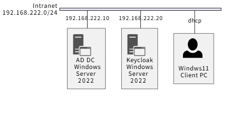
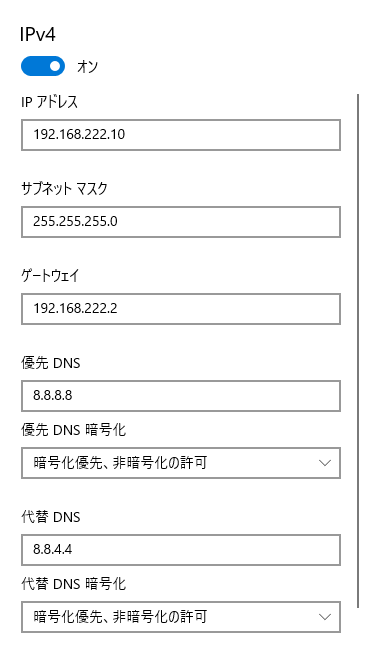
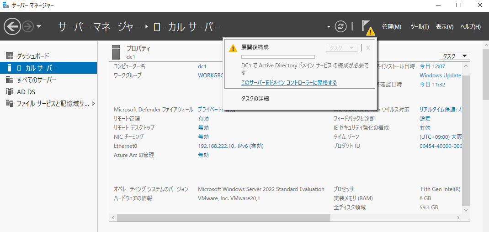
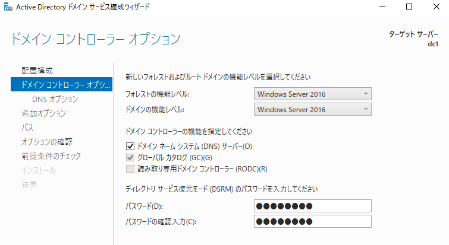
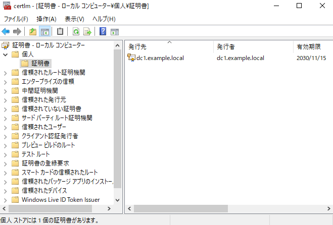
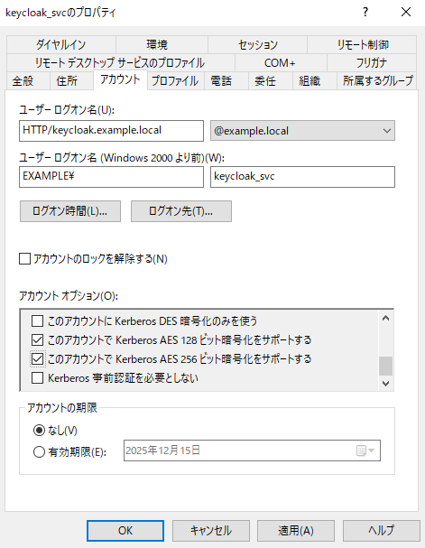
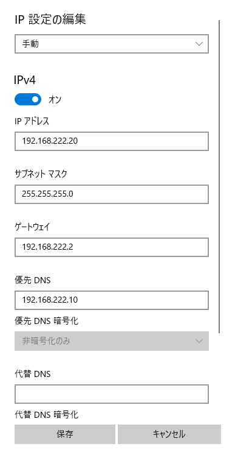
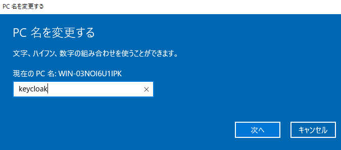

Keycloak と Windows AD で Windows SSO
===

## ネットワーク構成



- Active Directory サーバ

    | 項目      | 内容                |
    | :-------- | :------------------ |
    | OS        | Windows Server 2022 |
    | ホスト名  | dc1                 |
    | IPv4      | 192.168.222.10      |
    | ドメイン  | EXAMPLE.LOCAL       |
    | NetBIOS名 | EXAMPLE             |

- Keycloak

    | 項目     | 内容                          |
    | :------- | :---------------------------- |
    | OS       | Windows Server 2022           |
    | ホスト名 | keycloak                      |
    | IPv4     | 192.168.222.20                |
    | Keycloak | 26.4.5                        |
    | JDK      | Microsoft Build of OpenJDK 21 |

- Windows Client

    | 項目 | 内容                |
    | :--- | :------------------ |
    | OS   | Windows 11 Pro 25H2 |
    | IPv4 | DHCP                |


---

## Active Directory サーバ

### IP アドレスとコンピュータ名の設定

1. 静的IPアドレスの設定: ADサーバに静的IPアドレスを設定します。

    設定 ⇒ ネットワークとインターネット ⇒ イーサネット ⇒ ネットワーク ⇒ IP 設定の編集ボタンを押下

    

2. コンピューター名の変更: サーバーマネージャーから適切なコンピューター名に変更し、再起動します。

    設定 ⇒ システム ⇒ 詳細情報 ⇒ この PC の名前を変更

    

一旦、OS を再起動する。


### AD DS のインストール

1. サーバーマネージャ ⇒ 管理 ⇒ 役割と機能の追加

    

2. **インストールの種類の選択** 画面で **役割ベースまたは機能ベースのインストール** を選択。
3. **対象サーバーの選択** 画面でローカルサーバー (dc1) を選択。
4. **サーバーの役割の選択** 画面で **Active Directory ドメイン サービス** にチェックを入れる。
5. **次へ** ボタンでページを送り、**インストール** ボタンを押下する。

必要かどうかはわからないけど、一応再起動する。

### ドメインコントローラーへの昇格（AD DS の構成）

1. サーバーマネージャー上部の警告フラグ ⇒ **このサーバーをドメインコントローラーに昇格する** を選択。

    

2. **配置構成** 画面で **新しいフォレストを追加する** を選択 ⇒ ルート ドメイン名 (ここでは、**example.local**) を入力。

    

3. **ドメイン コントローラーのオプション** 画面で、
    - フォレストの機能レベルとドメインの機能レベルのバージョンを適切する (例: Windows Server 2016) に設定する。
    - DSRM パスワード (ディレクトリ サービス復元モード パスワード) を設定する。

    

4. **DNS オプション** 画面は変更しない。
5. **追加のオプション** 画面は、表示される NetBIOS ドメイン名を確認し、問題なければ **次へ** ボタンを押下。
6. **パス** 画面も特にこだわりがなければ **次へ** ボタンを押下し、**オプションの確認** 画面を確認後、**次へ** ボタンを押下。
7. **前提条件のチェック** 画面で **インストール** ボタンを押下。
8. インストールが完了すると、自動で OS が再起動します。

### LDAPS のための証明書設定

1. 自己証明書の作成

    ```bash
    $dns = "dc1.example.local"
    New-SelfSignedCertificate `
        -DnsName $dns `
        -CertStoreLocation "Cert:\LocalMachine\My" `
        -KeyLength 2048 `
        -KeyExportPolicy Exportable `
        -NotAfter (Get-Date).AddYears(5) `
        -FriendlyName "LDAPS Self-Signed" `
        -TextExtension @("2.5.29.37={text}1.3.6.1.5.5.7.3.1")
    ```

    **certlm.msc** を起動し、個人 ⇒ 証明書 フォルダに作成されます。

    

2. 証明書のエクスポート

    証明書の右クリックメニュー ⇒ すべてのタスク ⇒ エクスポート を選択し、証明書をエクスポートする。  
    秘密鍵は不要で、PEM形式 (DER形式でも問題ないと思うが、試していない)。  
    エクスポートした証明書のファイル名は **C:\dc1-ldaps.cer** とする。

3. エクスポートした証明書を Windows Server の信頼ストアへ追加

    ```powershell
    Import-Certificate `
        -FilePath C:\dc1-ldaps.cer `
        -CertStoreLocation Cert:\LocalMachine\Root
    ```

4. ドメインコントローラの再起動

    ```powershell
    Restart-Service ntds -f
    Restart-Service dns
    ```

    では LDAPS が有効にならなかったので OS 再起動。

5. dc1-ldaps.cer を Keycloak サーバにコピー

    ```powershell
    scp C:\dc1-ldaps.cer ubuntu@192.168.222.20:/tmp
    ```

### SPN (Service Principal Name) 関連設定

Kerberos認証（SPNEGO）のために、Keycloakが使用するサービスアカウント (Service Principal Name: SPN) をADに登録し、keytabファイルを作成します。

1. Keycloak用サービスアカウントの作成

    アカウント名は keycloak_svc とします。

    ```powershell
    New-ADUser -Name "keycloaksvc" `
        -SamAccountName "keycloaksvc" `
        -UserPrincipalName "keycloaksvc@EXAMPLE.LOCAL" `
        -AccountPassword (ConvertTo-SecureString "P@ssw0rD" -AsPlainText -Force) `
        -Enabled $true
    ```

2. AES の有効化

    コマンドで実行したかったが、AI が提示したコマンドは何故か実行できなかった。。。

    


3. SPNの登録

    ドメインコントローラーで、管理者権限のコマンドプロンプトまたはPowerShellで以下のコマンドを実行し、サービスプリンシパル名 (SPN) をアカウントに登録します。

    ```powershell
    # Keycloak のホスト名を keycloak.example.local、レルム名を EXAMPLE.LOCAL として
    # Keycloak サーバのホスト名でSPNを登録
    setspn -A HTTP/keycloak.example.local keycloaksvc
    ```

4. keytab ファイルの作成 (AES256)

    ktpass コマンドを使用して、AES256 暗号化アルゴリズムを指定して keytab ファイルを作成します。

    ```powershell
    ktpass /princ HTTP/keycloak.example.local@EXAMPLE.LOCAL `
        /mapuser keycloaksvc@EXAMPLE.LOCAL `
        /pass * `
        /crypto AES256-SHA1 `
        /ptype KRB5_NT_PRINCIPAL `
        /out C:\keycloak.keytab
    ```

5. keycloak.keytab を Keycloak サーバにコピー

    ```powershell
    scp C:\keycloak.keytab ubuntu@192.168.222.20:/tmp
    ```


---

## Keycloak

### IP アドレスとコンピュータ名の設定

1. 静的IPアドレスの設定: ADサーバに静的IPアドレスを設定します。

    設定 ⇒ ネットワークとインターネット ⇒ イーサネット ⇒ ネットワーク ⇒ IP 設定の編集ボタンを押下

    

2. コンピューター名の変更: サーバーマネージャーから適切なコンピューター名に変更し、再起動します。

    設定 ⇒ システム ⇒ 詳細情報 ⇒ この PC の名前を変更

    

一旦、OS を再起動する。


### Keycloak のインストール

- JDK のインストール

    [Microsoft Build of OpenJDK をダウンロードする](https://learn.microsoft.com/ja-jp/java/openjdk/download#openjdk-21) から OpenJDK をダウンロードし、インストールする。  
    Microsoft Build of OpenJDK は、特に何も変更しなければ C:\Program Files\Microsoft\jdk-21.0.9.10-hotspot にインストールされます。

- Keycloack のインストール

    [keycloak.org](https://www.keycloak.org/downloads) または [Github](https://github.com/keycloak/keycloak) から keycloak-26.4.5.zip をダウンロードし、C:\keycloak に展開する。

### Windows の AD サーバが使用しているサーバ証明書の取得

- Java の信頼する証明書への登録

    ```powershell
    keytool.exe -importcert -alias dc1 `
        -file "C:\dc1-ldaps.cer" `
        -cacerts -storepass changeit -noprompt
    ```

    - 登録確認

        ```powershell
        keytool -list `
            -keystore "C:\Program Files\Microsoft\jdk-21.0.9.10-hotspot\lib\security\cacerts" `
            -storepass changeit
        ```

### Keytab ファイルのコピー

AD サーバで作成した keycloak.keytab を、ここでは C:\keycloak.keytab にコピーするものとします。

### Keycloak の起動

- 初期設定（standaloneモード）

    ```powershell
    cd c:\keycloak\bin\
    ./kc.bat build
    ```

- Keycloak の起動 (開発用)

    今のところ、本番稼働は考えていないので、開発用で起動します。

    ```powershell
    $env:KC_BOOTSTRAP_ADMIN_USERNAME = "admin"
    $env:KC_BOOTSTRAP_ADMIN_PASSWORD = "admin"

    .\kc.bat start-dev
    ```

### AD 連携

1. 左側メニューの一番下の **User federation** を選択
2. User federation メニューから **Add LDAP provider**

3. 設定

    デフォルト値を変更した項目だけ記載する。

    - Connection and authentication settings
        - Connection URL:
            - ldaps://dc1.example.local:636

                ldap://dc1.example.local:389 を設定して **Enable StartTLS** を **On** でもよい気がしますが、**Save** ボタン押下時にエラーが出たので、StartTLS は諦めました。

        - Bind DN: Administrator@EXAMPLE.LOCAL
        - Bind credentials: Administrator のパスワード (ログインパスワード)

    - LDAP searching and updating
        - Edit mode: READ_ONLY
        - Users DN: CN=Users,DC=example,DC=local
        - Username LDAP attribute: sAMAccountName
        - Search scope: Subtree

    - Kerberos integration
        - Kerberos realm: EXAMPLE.LOCAL
        - Server principal: HTTP/keycloak.example.local@EXAMPLE.LOCAL
        - Key tab: C:\keycloak.keytab
        - Kerberos principal attribute: userPrincipalName
        - Debug: On
        - Use Kerberos for password authentication: On

4. 動作確認

    設定画面の各所で接続確認は実施できましたが、下記

    User federation -> LDAP 画面の右上の **Action** から、**Sync all users** を選択すると、AD サーバに登録されているユーザを Keycloak に取り込むことができます。  
    これに失敗する場合は、LDAP の設定がどこか間違っています。


---

## Windows クライアントのドメイン参加準備

### Windows Server

- DNS に keycloak.example.local の登録

- SSO 動作確認用ユーザアカウント登録

    ```bash
    New-ADUser -Name "ynaka" `
        -SamAccountName "ynaka" `
        -UserPrincipalName "ynaka@EXAMPLE.LOCAL" `
        -AccountPassword (ConvertTo-SecureString "P@ssw0rD" -AsPlainText -Force) `
        -Enabled $true
    ```

    UserPrincipalName を付け忘れると、Keycloak が LDAP 検索でユーザを見つけられないようです。  
    作成済みユーザに UserPrincipalName を設定する場合は下記のように設定する。
    
    ```powershell
    Set-ADUser ynaka -UserPrincipalName ynaka@EXAMPLE.LOCAL
    ```

    設定内容は、

    ```powershell
    Get-ADUser ynaka
    ```

    で確認できます。

### dc1.example.local の逆引き

逆引きゾーン 222.168.192.in-addr.arpa が無い場合は、

```powershell
Add-DnsServerPrimaryZone `
    -NetworkId "192.168.222.0/24" `
    -ReplicationScope "Domain"

```

を実行してゾーンを作成後、

```powershell
Add-DnsServerResourceRecordPtr `
    -Name "10" `
    -ZoneName "222.168.192.in-addr.arpa" `
    -PtrDomainName "dc1.example.local"
```

### keycloak.example.local の名前解決

AD サーバの DNS の設定で、keycloak.example.local の正引き、逆引き設定を行います。

- 正引き

    ```powershell
    Add-DnsServerResourceRecordA `
        -Name "keycloak" `
        -ZoneName "example.local" `
        -IPv4Address "192.168.222.20"
    ```

- 逆引き

    ```powershell
    Add-DnsServerResourceRecordPtr `
        -Name "20" `
        -ZoneName "222.168.192.in-addr.arpa" `
        -PtrDomainName "keycloak.example.local"
    ```

### 名前の解決の確認

下記の名前・IPアドレスが解決できれば DNS は正しく設定されています。

```powershell
nslookup dc1.example.local
nslookup keycloak.example.local
nslookup 192.168.222.10
nslookup 192.168.222.20
```

### ユーザアカウントの同期

Keycloak に Admin 権限でログインし、User federation -> LDAP 画面の右上の **Action** から、**Sync changed users** を選択すると、ユーザが 1 アカウント追加された旨のメッセージが表示されると思います。

ユーザアカウント同期後、Users ⇒ Search user で、SSO をテストするユーザ (ここでは ynaka) を検索し、Role mapping タブで、とりあえず admin ロールを設定しておきます。ynaka アカウントが Keycloak にログインするための設定なので、Keycloak にログインさせるユーザではない場合設定不要です。また、本番運用では admin ロールじゃないロールを設定すべきです。


---

## Windows クライアント

### 設定

- 設定 -> ネットワークとインターネット -> イーサネット -> DNS サーバの割り当て -> 編集 ボタン押下

    

    下記の ping コマンドで応答があれば OK。

    ```powershell
    ping dc1.example.local
    ping keycloak.example.local
    ```

- 設定 -> システム -> バージョン情報 -> ドメインまたはワークグループ -> **変更(C)...** ボタンを押下

    **所属するグループ** で **ドメイン** を選択し、テキストボックスに **example.local** を入力する。

    ドメインに参加するためのアクセス許可のあるアカウントには Administrator を入力し、Administrator のパスワードを入力する。

    

    が表示されればドメインに参加できてます。  
    再起動すると example.local ドメインのユーザで Windows にログインできるようになっていると思います。

### 動作確認

Windows11 にログイン後、Edge を起動し、**http://keycloak:8080/** を参照して、Keycloak のパスワード認証無しにログインできれば、とりあえず、設定完了です。

### ブラウザが送信している Negotiate トークンの確認方法

1. Edge ブラウザのアドレスバーに **edge://net-internals/#events** を入力する。
2. **edge://net-internals/#events** 画面内の **edge://net-internals/#events** リンクを選択する。
3. 下記画面に遷移するので、

    - Include raw bytes (will include cookies and credentials) を選択
    - Maximum log size を 100 MB 程度

    に設定して、**Start Logging to Disk** ボタンを押下。

4. 出力ファイルを設定すると、Edge ブラウザで発生するイベントをファイル出力します。

    イベントログ採取時は、ブラウザの設定でニュースや広告、背景画像等を無効化し、アドオンも無効化するなどして、通信を最小限まで減らしてから実行することをお勧めします。10 秒程度の操作ログでも 50 MB 程度出力されるため、解析が困難になります。

5. 出力された JSON ファイルをテキストエディタで開き、**Authorization: Negotiate** や **kerberos** というキーワードで検索してヒットした行周辺を確認すると Negotiate トークンを取得できます。

    ```text title="出力例"
    {"params":{"headers":["Host: keycloak.example.local:8080","Connection: keep-alive","Authorization: Negotiate YIIHQQYGKwYBBQUCoII... (長いので以下省略)
    ```
