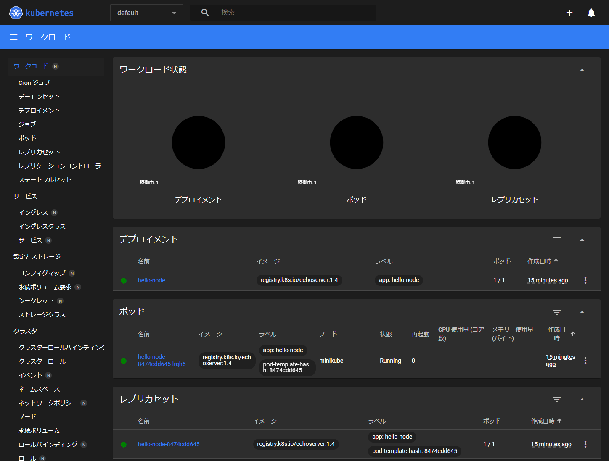

Kubernetes メモ
===

!!! note

    * minikube の起動には、CPU が 2 個以上必要です。
    * 2023/10 現在、minikube は containerd には対応していないらしい。ドライバに Docker や Qemu を使うと、CPU の仮想化支援機能やハイパーバイザを気にせずに使用できそうです。

## 環境作成

### [Docker](https://docs.docker.com/engine/install/ubuntu/)

* Ubuntu Linux

    1. 古いバージョンの削除 (インストールしていた場合)

        ```bash
        sudo apt-get remove docker docker-engine docker.io containerd runc
        ```

    2. APT リポジトリの設定

        * 関連ツールのインストール

            ```bash
            sudo apt-get update
            sudo apt-get -y install \
                ca-certificates \
                curl \
                gnupg \
                lsb-release
            ```

        * GPG key のインストール

            ```bash
            sudo mkdir -p /etc/apt/keyrings
            curl -fsSL https://download.docker.com/linux/ubuntu/gpg | \
                sudo gpg --dearmor -o /etc/apt/keyrings/docker.gpg
            ```

        * リポジトリの追加

            ```bash
            echo \
                "deb [arch="$(dpkg --print-architecture)" signed-by=/etc/apt/keyrings/docker.gpg] https://download.docker.com/linux/ubuntu \
                "$(. /etc/os-release && echo "$VERSION_CODENAME")" stable" | \
                sudo tee /etc/apt/sources.list.d/docker.list > /dev/null
            ```

        * Docker のインストール

            ```bash
            sudo apt-get update
            sudo apt-get install -y \
                docker-ce docker-ce-cli \
                containerd.io docker-buildx-plugin \
                docker-compose-plugin
            ```

        * ユーザ権限の設定

            ```bash
            sudo usermod -aG docker ubuntu
            ```

        * 自動起動設定

            ```bash
            sudo systemctl enable docker
            sudo systemctl start docker
            ```


### Kubernetes

[kubectlのインストールおよびセットアップ](https://kubernetes.io/ja/docs/tasks/tools/install-kubectl/)

* Debian / Ubuntu

    ```bash
    sudo apt-get update
    sudo apt-get install -y apt-transport-https gnupg2
    curl -s https://packages.cloud.google.com/apt/doc/apt-key.gpg | \
        sudo apt-key add -
    echo "deb https://apt.kubernetes.io/ kubernetes-xenial main" | \
        sudo tee -a /etc/apt/sources.list.d/kubernetes.list
    sudo apt-get update
    sudo apt-get install -y kubectl
    ```

### kubectl コマンドの補完

* bash

    ```bash
    kubectl completion bash >> $HOME/.bashrc_kuberctl
    echo 'source $HOME/.bashrc_kuberctl' >> $HOME/.bashrc
    source $HOME/.bashrc
    ```

    * `kubectl tabキー` で `_get_comp_words_by_ref: command not found` が出る

        Bash の自動補完パッケージが足りないので、追加すれば解消します。  
        自動補完パッケージインストール後、再ログインすると有効になります。

        ```bash
        sudo apt install -y bash-completion
        ```

### minikube

[minikube start](https://minikube.sigs.k8s.io/docs/start/)

* Debian / Ubuntu

    ```bash
    curl -LO https://storage.googleapis.com/minikube/releases/latest/minikube_latest_amd64.deb
    sudo dpkg -i minikube_latest_amd64.deb
    ```


## 動作確認

### [Hello Minikube](https://kubernetes.io/ja/docs/tutorials/hello-minikube/)

解説は [minikube使ってみて、Kubernetesに入門してみた気分になる](https://qiita.com/ishibashi-futoshi/items/8fbe1da7ab703f891db3) が分かりやすいです。

1. Start Cluster (結構時間がかかります)

    ```bash
    minikube start
    ```

2. hello-minikube のデプロイ

    ```bash
    $ kubectl create deployment hello-minikube --image=k8s.gcr.io/echoserver:1.10
    deployment.apps/hello-minikube createddeployment.apps/hello-minikube created
    ```

    * デプロイの確認

        ```bash
        $ kubectl get deployments
        NAME             READY   UP-TO-DATE   AVAILABLE   AGE
        hello-minikube   1/1     1            1           5m41s
        ```

    * Pod を確認

        ```bash
        $ kubectl get pods
        NAME                              READY   STATUS    RESTARTS   AGE
        hello-minikube-5db9b875f7-chxrv   1/1     Running   0          7m52s
        ```

    * クラスタイベントの確認

        ```bash
        $ kubectl get events
        LAST SEEN   TYPE     REASON                    OBJECT                                 MESSAGE
        8m56s       Normal   Scheduled                 pod/hello-minikube-5db9b875f7-chxrv    Successfully assigned default/hello-minikube-5db9b875f7-chxrv to minikube
        8m53s       Normal   Pulling                   pod/hello-minikube-5db9b875f7-chxrv    Pulling image "k8s.gcr.io/echoserver:1.10"
        8m17s       Normal   Started                   pod/hello-minikube-5db9b875f7-chxrv    Started container echoserver
        8m10s       Normal   Pulled                    pod/hello-minikube-5db9b875f7-chxrv    Successfully pulled image "k8s.gcr.io/echoserver:1.10" in 1m3.811994362s (1m3.812681651s including waiting)
        8m9s        Normal   Created                   pod/hello-minikube-5db9b875f7-chxrv    Created container echoserver
        8m56s       Normal   SuccessfulCreate          replicaset/hello-minikube-5db9b875f7   Created pod: hello-minikube-5db9b875f7-chxrv
        8m57s       Normal   ScalingReplicaSet         deployment/hello-minikube              Scaled up replica set hello-minikube-5db9b875f7 to 1
        18m         Normal   Starting                  node/minikube                          Starting kubelet.
        18m         Normal   NodeHasSufficientMemory   node/minikube                          Node minikube status is now: NodeHasSufficientMemory
        18m         Normal   NodeHasNoDiskPressure     node/minikube                          Node minikube status is now: NodeHasNoDiskPressure
        18m         Normal   NodeHasSufficientPID      node/minikube                          Node minikube status is now: NodeHasSufficientPID
        18m         Normal   NodeAllocatableEnforced   node/minikube                          Updated Node Allocatable limit across pods
        17m         Normal   Starting                  node/minikube
        17m         Normal   RegisteredNode            node/minikube                          Node minikube event: Registered Node minikube in Controller
        ```

    * クラスタの設定確認

        ```bash
        $ kubectl config view
        長いので出力例は省略
        ```

3. サービスの作成

    ```bash
    $ kubectl expose deployment hello-minikube --type=LoadBalancer --port=8080
    service/hello-minikube exposed
    ```

    * サービスの確認

        ```bash
        $ kubectl get services
        NAME             TYPE           CLUSTER-IP    EXTERNAL-IP   PORT(S)          AGE
        hello-minikube   LoadBalancer   10.111.26.2   <pending>     8080:30374/TCP   14s
        kubernetes       ClusterIP      10.96.0.1     <none>        443/TCP          3h33m
        ```

    * デプロイされたコンテナの動作確認

        ```bash
        $ curl $(minikube service hello-minikube --url)

        Hostname: hello-minikube-5db9b875f7-chxrv

        Pod Information:
                -no pod information available-

        Server values:
                server_version=nginx: 1.13.3 - lua: 10008

        Request Information:
                client_address=10.244.0.1
                method=GET
                real path=/
                query=
                request_version=1.1
                request_scheme=http
                request_uri=http://192.168.49.2:8080/

        Request Headers:
                accept=*/*
                host=192.168.49.2:30374
                user-agent=curl/7.68.0

        Request Body:
                -no body in request-
        ```

    * デプロイされたコンテナの動作確認 その２

        ```bash
        $ minikube ssh
        $ curl 10.111.26.2:8080

        上記と同じ内容が出力されます。
        ```

4.  クリーンアップ

    ```bash
    kubectl delete service hello-minikube
    kubectl delete deployment hello-minikube
    ```


### [2048](https://github.com/alexwhen/docker-2048)

コンテナイメージ ⇒ Pod の起動 ⇒ サービスの起動、の手順でノードを起動します。

1. Start Cluster (結構時間がかかります)

    ```bash
    minikube start
    ```

2. Docker イメージ作成

    ```bash
    git clone https://github.com/alexwhen/docker-2048.git
    cd docker-2048/
    docker build -t docker-2048 .
    ```

3. pod の起動

    ```bash
    kubectl run docker-2048 --image=alexwhen/docker-2048 --port=80
    kubectl get pod
    ---
    NAME         READY   STATUS    RESTARTS   AGE
    2048-nginx   1/1     Running   0          87s
    ```

4. サービスの起動

    ```bash
    kubectl expose pod docker-2048 --name pod2048 --port 80 --type NodePort
    kubectl get service
    ```

5. pod2048 サービスへの接続方法

    ```bash
    $ minikube service list
    |----------------------|---------------------------|--------------|---------------------------|
    |      NAMESPACE       |           NAME            | TARGET PORT  |            URL            |
    |----------------------|---------------------------|--------------|---------------------------|
    | default              | kubernetes                | No node port |                           |
    | default              | pod2048                   |           80 | http://192.168.49.2:32009 |
    | kube-system          | kube-dns                  | No node port |                           |
    | kubernetes-dashboard | dashboard-metrics-scraper | No node port |                           |
    | kubernetes-dashboard | kubernetes-dashboard      | No node port |                           |
    |----------------------|---------------------------|--------------|---------------------------|
    ```

    ブラウザで URL 欄の `http://192.168.49.2:32009` を参照すると 2048 が楽しめます。


### Kubernets ダッシュボード

* 起動

    ```bash
    minikube dashboard
    ```

    dashboard コマンドを実行してしばらくすると URL が表示されます。ただ、localhost しかバインドしてないっぽいので、mini
    kube をインストールした PC に GUI 環境がない場合は SSH トンネル経由でアクセスすることになります。

    


## 参考サイト

* [公式チュートリアル](https://kubernetes.io/ja/docs/tutorials/kubernetes-basics/)
* [とほほのKubernetes入門](https://www.tohoho-web.com/ex/kubernetes.html)
* [Kubernetes超入門](https://qiita.com/dsagnlaiweudlbfna/items/55b162197afa74306067)
