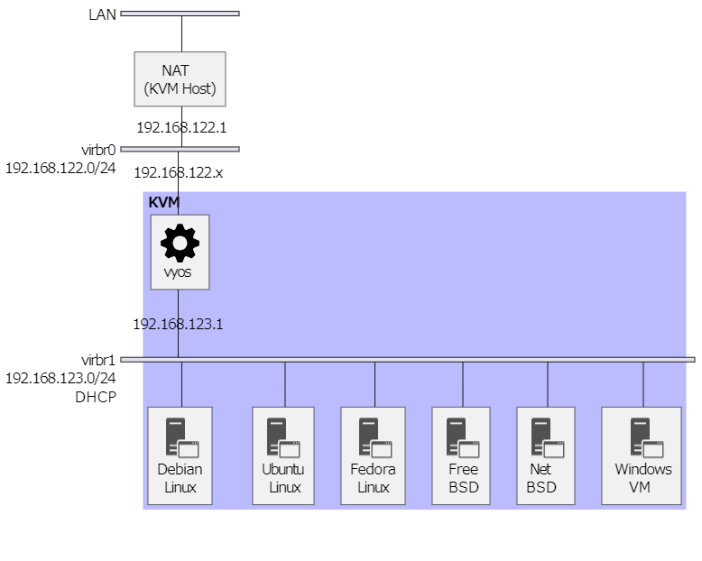

環境準備
===

## 仮想化支援機能の確認

仮想化支援機能は仮想化ソフトウェアが行う処理の一部を CPU が負担することで仮想マシン処理を高速化する機能で、Intel CPU の場合 **Intel-VT**、AMD CPU の場合 **AMD-V** が相当します。

- 仮想化支援機能対応 CPU の確認方法

    ```bash
    egrep -c '(vmx|svm)' /proc/cpuinfo
    ```

    最近販売されている x86_64 系 PC であれば 0 以上 (CPUのコアの数) の値が出力されると思います。0 の場合は BIOS の設定で無効にされているか、仮想化ソフトの設定でゲスト OS の仮想化支援機能の使用が制限されているのかを確認してみてください。


## インストール

- Ubuntu Linux 24.04

    ```bash
    sudo apt install -y \
        qemu-kvm libvirt-daemon-system libvirt-clients \
        bridge-utils virtinst libosinfo-bin
    ```

    - qemu-kvm  
      KVM を実行するために必要な QEMU パッケージらしい。  
      qemu-kvm というパッケージがインストールされるのではなく、主に CPU に合わせた QEMU のパッケージを選んでくれます。  
      (もしかして昔のパッケージ名で、今は `qemu-system-x86` が正しいのかもしれない)

    - libvirt-daemon-system、libvirt-clients  
      仮想化アプリケーション、ハイパーバイザーを抽象的に操作できるようにするlibvirtのパッケージ

    - bridge-utils  
      ブリッジを構成・設定するパッケージ

    - virtinst  
      CUI で仮想マシンの操作をするのに必要なパッケージ

    - libosinfo-bin  
      virt-install コマンドで --os-variant オプションを使用するために必要なパッケージ


### 設定

- ユーザアカウント

    KVM を利用するユーザは libvirt グループと kvm グループに所属させ、KVM の操作権限を付与します。

    ```bash
    sudo usermod -aG libvirt,kvm UserID
    ```

    追加したグループは、再度ログインするときに有効になります。

- libvirt の起動設定・動作確認

    ```bash
    sudo systemctl enable libvirtd
    sudo systemctl start libvirtd
    sudo systemctl status libvirtd
    ```

### 仮想ネットワーク作成

apt で KVM をインストールすると、デフォルトで KVM ホストを NAT とする仮想ネットワーク `virbr0` が作成されます。  
ここでは、下記図のような仮想ネットワークを作成します。



1. 仮想ネットワーク定義ファイル (とりあえずここでは virbr1.xml) の作成

    ```xml
    <network>
        <name>virbr1</name>
        <domain name="network" />
    </network>
    ```

2. 仮想ネットワークの登録

    ```bash
    virsh net-define ./virbr1.xml
    ```

3. 仮想ネットワークの自動起動設定

    ```bash
    virsh net-autostart virbr1
    ```

4. 仮想ネットワークの起動

    ```bash
    virsh net-start virbr1
    ```

    エラーになる場合は virsh コマンド実行ユーザに libvirt や kvm の操作権限がないことが考えられます。一旦、再ログインもしくは再起動してから実行してみてください。  
    `ip address show` や `virsh net-list` に `virbr1` が表示されていれば設定できています。  
    設定ミスった、と思ったら、

    ```bash
    virsh net-destroy virbr1
    ```

    を実行すると、最初から設定をやり直せます。使い方を知っていれば `net-edit` の方が手軽だと思います。
